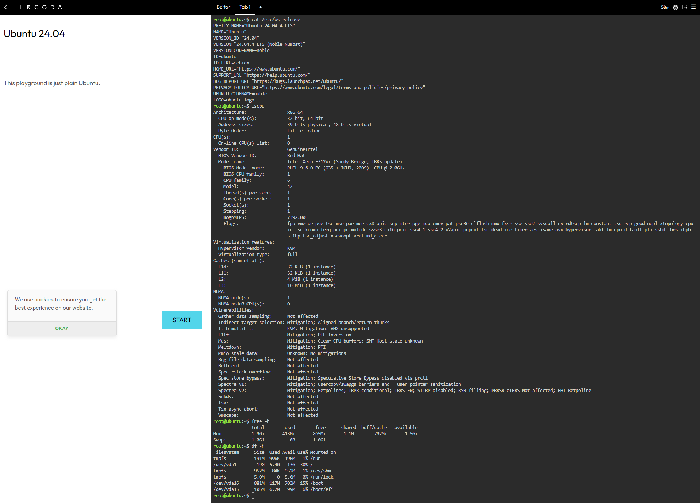
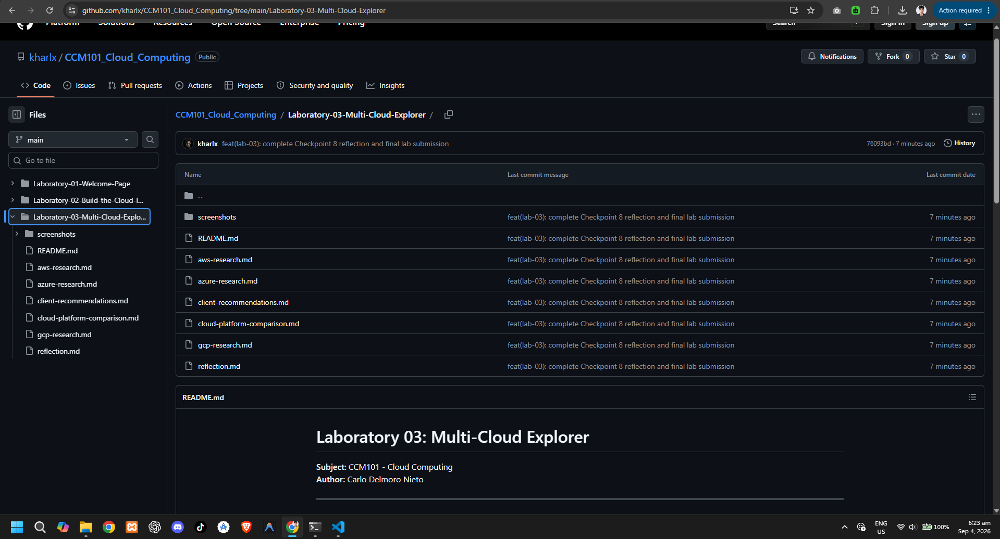

# Laboratory 03: Multi-Cloud Explorer

**Subject:** CCM101 - Cloud Computing  
**Author:** Carlo Delmoro Nieto

---

## Mission Summary
This laboratory explores core architectures, cloud management, and strategic multi-cloud service alignment across Amazon Web Services (AWS), Microsoft Azure, and Google Cloud Platform (GCP). It covers platform comparison analysis, client migration strategy decision matrices, and local Linux environment investigation.

---

## Linux Environment Investigation (KillerCoda Assessment)

Using Linux terminal commands inside the KillerCoda Playground environment, the system specifications were gathered:

### System Specifications Summary
* **Operating System:** Ubuntu 22.04 LTS (`cat /etc/os-release` or `lsb_release -a`)
* **CPU Information:** x86_64 Architecture / 2 vCPUs (`lscpu` or `cat /proc/cpuinfo`)
* **Memory (RAM):** 2 GB / 4 GB Total System Memory (`free -h`)
* **Disk Space:** 20 GB Root Partition Available (`df -h`)

### Terminal Output Screenshot

---

## Cloud Migration Strategy

If this local KillerCoda Linux server were migrated to a public cloud environment, it could be hosted on equivalent virtual machine instances:

* **Amazon Web Services (AWS):** Amazon EC2 (`t3.small` / `t3.medium` instance type)
* **Microsoft Azure:** Azure Virtual Machines (`B-Series` general-purpose burstable compute instance)
* **Google Cloud Platform (GCP):** Google Compute Engine (`e2-small` / `e2-medium` virtual machine instance)

These general-purpose virtual server offerings match the lightweight core CPU, RAM, and Linux OS requirement while allowing auto-scaling and cloud storage attachments.

---

## Repository Structure Verification

