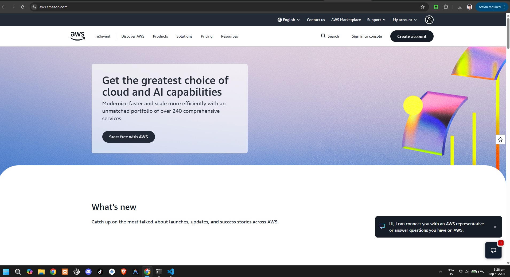

# Amazon Web Services (AWS) Research Report

## Brief Overview
Amazon Web Services (AWS) is a comprehensive and evolving cloud computing platform provided by Amazon. Launched publicly in 2006, AWS was a pioneer in the cloud infrastructure market, delivering infrastructure as a service (IaaS), platform as a service (PaaS), and software as a service (SaaS) solutions worldwide.

## Global Infrastructure
AWS operates a massive global infrastructure spanning over 100 Availability Zones within 30+ geographic regions worldwide. Each AWS Region consists of multiple, isolated, and physically separate Availability Zones (AZs) connected through low-latency, high-throughput, and redundant networking.

## Cloud Management Console
The AWS Management Console is a web-based portal used to provision, manage, and monitor AWS resources. It features a customizable interface, direct access to AWS CloudShell, and a unified search utility to navigate through hundreds of integrated services.

## Four (4) Core Services
* **Amazon EC2 (Elastic Compute Cloud):** Offers scalable virtual servers for compute capacity on demand.
* **Amazon S3 (Simple Storage Service):** Provides scalable, durable object storage for data backup and analytics.
* **Amazon VPC (Virtual Private Cloud):** Delivers isolated virtual networks to host provisioned resources securely.
* **AWS IAM (Identity and Access Management):** Controls authentication and authorization permissions across resources.

## Three (3) Advantages
* **Market Pioneer & Maturity:** Broadest range of mature cloud services and comprehensive documentation.
* **Global Footprint:** Massive distributed physical infrastructure ensuring low latency and high availability.
* **Extensive Ecosystem:** Vast network of third-party software integrations, community support, and marketplace solutions.

## Typical Enterprise Use Cases
* Hosting high-traffic web applications with dynamic auto-scaling rules.
* Enterprise data analytics and data lake management using S3 and Redshift.
* Hybrid cloud infrastructure extensions using AWS Outposts and Direct Connect.
