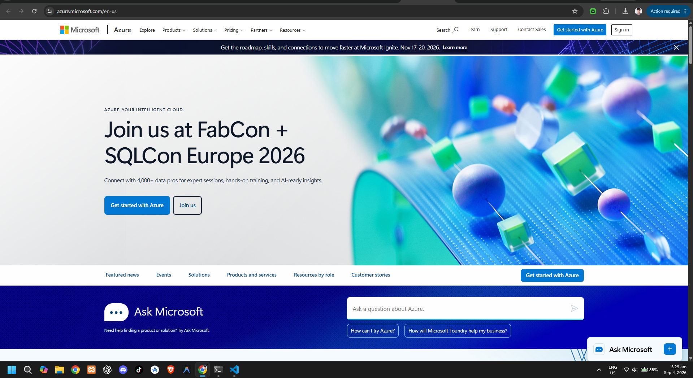

# Microsoft Azure Research Report

## Brief Overview
Microsoft Azure is a leading cloud platform introduced by Microsoft in 2010. It provides an extensive array of cloud services covering compute, storage, databases, and networking, explicitly optimized to integrate with existing Microsoft enterprise environments.

## Global Infrastructure
Azure possesses one of the largest global cloud footprints, with physical infrastructure located across more than 60 regions globally. Azure utilizes Availability Zones and region-pairing strategies to deliver high availability, local compliance, and disaster recovery.

## Cloud Management Console
The Azure Portal is a unified, blade-based web management console designed to build, manage, and monitor applications. It integrates Azure Cloud Shell (Bash and PowerShell) alongside built-in resource metrics and governance tools.

## Four (4) Core Services
* **Azure Virtual Machines:** On-demand, flexible compute instances for running Windows and Linux workloads.
* **Azure Blob Storage:** Massively scalable object storage for unstructured data, logs, and backups.
* **Azure Virtual Network (VNet):** Private network environment allowing secure resource-to-resource communication.
* **Microsoft Entra ID (formerly Azure AD):** Cloud-based identity and access management service.

## Three (3) Advantages
* **Seamless Microsoft Integration:** Native support for Active Directory, Windows Server, SQL Server, and Microsoft 365.
* **Strong Enterprise Trust:** Robust hybrid capabilities powered by Azure Arc and wide compliance coverage.
* **Flexible Licensing:** Cost savings via Azure Hybrid Benefit for existing Windows and SQL Server licenses.

## Typical Enterprise Use Cases
* Extending on-premises Active Directory environments to the cloud seamlessly.
* Enterprise ERP, CRM, and legacy Windows Server stack migrations.
* Modern hybrid cloud container management using Azure Kubernetes Service (AKS).