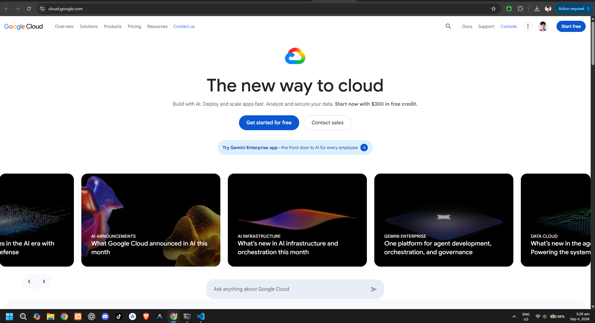

# Google Cloud Platform (GCP) Research Report

## Brief Overview
Google Cloud Platform (GCP), introduced in 2008, is a suite of public cloud computing services offered by Google. It operates on the same high-performance global infrastructure that Google uses internally for end-user products like Google Search, YouTube, and Gmail.

## Global Infrastructure
GCP's infrastructure is built around high-speed private fiber networking connecting over 35 regions and 100+ zones worldwide. GCP emphasizes high bandwidth, minimal latency, and environmentally sustainable data centers.

## Cloud Management Console
The Google Cloud Console is an intuitive web interface for managing cloud services. It provides clean tracking of real-time resource costs, a built-in Cloud Shell environment, and developer-focused deployment dashboards.

## Four (4) Core Services
* **Google Compute Engine (GCE):** High-performance, customizable virtual machine instances on Google infrastructure.
* **Google Cloud Storage (GCS):** Scalable object storage featuring fast retrieval and flexible storage classes.
* **Google Kubernetes Engine (GKE):** Fully managed environment for containerized application deployments.
* **Cloud IAM:** Granular access control and security permissions management for GCP projects.

## Three (3) Advantages
* **Industry Leader in AI/ML:** Native access to Google's advanced AI toolsets, TensorFlow, and custom TPU units.
* **Kubernetes Native:** Developed by the creators of Kubernetes, offering superior managed container orchestration.
* **Global Fiber Network:** Fast, low-latency private network infrastructure for efficient cross-region routing.

## Typical Enterprise Use Cases
* Big data analytics and real-time data streaming using Google BigQuery.
* Microservices architecture deployment via Google Kubernetes Engine (GKE).
* Machine learning model training and deployment using Vertex AI.